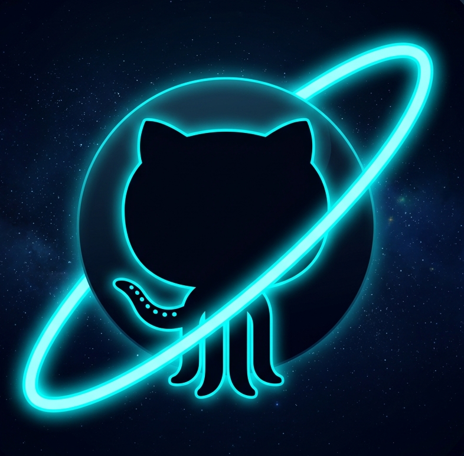
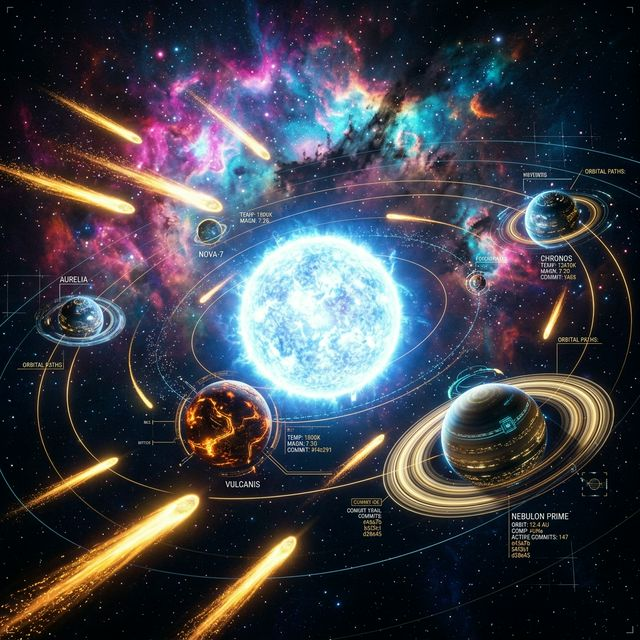

<div align="center">
  
  <h1>🌌 Stack Universe</h1>
  <p><strong>Every developer has a universe. Let's explore yours.</strong></p>

  

  <p>
    <a href="#-the-vision">Vision</a> •
    <a href="#-cosmic-features">Features</a> •
    <a href="#-ci-cd-space-weather">CI/CD Monitoring</a> •
    <a href="#-procedural-nebulas">Nebulas</a> •
    <a href="#-tech-stack">Tech Stack</a> •
    <a href="#-getting-started">Getting Started</a>
  </p>
</div>

<br />

> Forget boring graphs, generic tables, and pie charts. Your GitHub profile is a cosmic event waiting to be visualized.

**Stack Universe** is a 3D, WebGL-powered visualization tool that instantly transforms any GitHub developer's profile into an interactive, stunning solar system. It turns your life's work as a coder into a literal universe you can fly through, share, and show off.

---

## 🔭 The Vision

Type in any GitHub username and watch a unique universe manifest based on their contributions:

- ☀️ **The Central Star (You):** Your total stars, repositories, and account age generate a **Universe Score**. The higher your score, the larger, brighter, and hotter your central star burns—from a dim red dwarf to a blinding blue-white giant.
- 🪐 **The Planets (Your Languages/Repositories):** Your most-used programming languages/repositories orbit your star. The size of the planet represents how much of your code is written in that language/repository.
- 💫 **Shooting Stars (Recent Commits):** Live comets tear through your solar system representing your most recent commits!
- 🛰️ **Technical Overlays:** Every planet features technical rings indicating commit velocity over the last 12 months and fixed orbits for open Pull Requests.

---

## ⛈️ CI/CD Space Weather

Monitor your project's health through real-time cosmic phenomena. Stack Universe tracks your GitHub Actions to visualize the "weather" of your repositories:

- ☄️ **Build Comets:** Active CI/CD runs manifest as golden comets accelerating toward their parent planet, triggering an impact flash on completion.
- ☄️ **Action Meteors:** Recent build history orbits the planet as success (green), failure (red), or in-progress (pulsing yellow) particles.
- 🌈 **Deploy Streak Auras:** Long-running success streaks generate progressive golden and green auras around the planet.
- 💥 **Streak Shatters:** If a deployment fails, the aura explodes in a red-orange particle burst—visualizing the broken streak.
- 🌍 **Surface Overlays:** Planet surfaces glow with the hue of their latest build status, providing an instant health check at a glance.

---

## 🌌 Procedural Nebulas

The backdrop of your universe isn't just decoration—it's a procedural reflection of your journey as a developer:

- 🌞 **Emission Nebulas:** Radiating technical rays triggered by high star counts (10k+).
- 🌑 **Dark Nebulas:** Dim, light-absorbing voids for inactive profiles (6+ months).
- 🌈 **Reflection Nebulas:** Multi-colored shifting clouds for polyglots with many languages (8+).
- 🪐 **Planetary Nebulas:** Ring-shaped cosmic structures for prolific developers (100+ repos).
- 🌀 **Protostellar Nebulas:** Inward-swirling clouds for new accounts or early-stage explorers.
- 🛡️ **Supernova Remnants:** Expanding shockwaves reserved for those with a legendary 365-day coding streak.

---

## 🏆 The Hall of Giants

Think your universe is impressive? See how you stack up in the **Multiverse**. The landing page features a real-time leaderboard where top-ranking developers manifest as massive, golden stars floating in deep space.

Click anywhere in the background to engage the **Warp Drive** and be randomly dropped into a newly discovered developer's universe!

---

## 🛠️ The Tech Stack (What makes it glow)

Built for high performance, rendering thousands of orbital bodies at a smooth 60fps.

- **Framework:** [Next.js 14](https://nextjs.org/) (App Router) & React
- **3D Engine:** [Three.js](https://threejs.org/) & [React Three Fiber](https://docs.pmnd.rs/react-three-fiber/getting-started/introduction) + Drei
- **Post-Processing:** Bloom effects & Chromatic Aberrations powered by `@react-three/postprocessing`
- **Styling & UI Anim:** Tailwind CSS & Framer Motion
- **Database:** [Supabase](https://supabase.com/) (For global leaderboard and discovery tracking)
- **Data Source:** The Live GitHub GraphQL & REST APIs

---

## 🌠 Getting Started Locally

### Prerequisites

1.  Node.js (v18+)
2.  A [GitHub Personal Access Token](https://github.com/settings/tokens)
3.  A [Supabase](https://supabase.com/) project

### Installation

1. **Clone & Install:**

   ```bash
   git clone https://github.com/yourusername/stack-universe.git
   cd stack-universe
   npm install
   ```

2. **Environment Variables:**
   Create a `.env.local`:

   ```env
   GITHUB_TOKEN=your_token
   NEXT_PUBLIC_SUPABASE_URL=your_url
   NEXT_PUBLIC_SUPABASE_ANON_KEY=your_key
   ```

3. **Ignition:**
   ```bash
   npm run dev
   ```

---

<div align="center">
  <b>Built with ☕, 🌌, and too much Three.js.</b><br>
  <i>"Remember to look up at the stars and not down at your feet." - Stephen Hawking</i>
</div>
